# PayEase - UML Activity Diagrams (with Swimlanes)

This document contains the exact UML Activity Diagrams for the **PayEase - Instalment Shop Management System**, structured into swimlanes (partitions) representing the **Operator (Staff/Admin)**, the **System (Flask App)**, and the **Database** layers.

The diagrams follow standard UML Activity Diagram conventions:
* **Initial Node**: A solid black circle (`●`).
* **Activity Final Node**: A hollow circle surrounding a solid circle (`☉`).
* **Actions/Activities**: Rounded rectangles representing individual operations.
* **Decisions**: Diamonds with branch conditions.
* **Partitions (Swimlanes)**: Visual columns grouping activities by responsibility.

---

## Index of Activity Diagrams

The activity diagrams map directly to the system's core use cases:

| # | Use Case Module / Flow | Covered Use Cases | Target Users |
|---|------------------------|-------------------|--------------|
| 1 | [Authentication Flow](#1-authentication-flow) | Authenticate (Login/Logout) | All Users |
| 2 | [Customer Management CRUD](#2-customer-management-crud) | Manage Customers (CRUD), Search Customers & View Profiles | All Users |
| 3 | [Product & Inventory CRUD](#3-product--inventory-crud) | Manage Products & Inventory (CRUD) | Admins / Super Admin |
| 4 | [POS Checkout & Credit Sale](#4-pos-checkout--credit-sale) | POS Checkout (New Credit Sale) | Staff / Admins |
| 5 | [Instalment Plan & Rescheduling](#5-instalment-plan--rescheduling) | View Schedules, Reschedule Due Dates | Staff / Admins |
| 6 | [Record EMI Payment & Receipt](#6-record-emi-payment--receipt) | Record EMI Collection Payment, Print Payment Receipt | Staff / Admins |
| 7 | [BI Reports, Financials & Exports](#7-bi-reports-financials--exports) | View Operational Reports, View BI Dashboard, View Financial Reports, Export CSV/Excel | All Users (Role-Restricted) |
| 8 | [Configure Settings & Database Backups](#8-configure-settings--database-backups) | Configure Shop Settings, Create/Restore Backups | Admins / Super Admin |

---

## 1. Authentication Flow
Details the security checks performed during operator sign-in, mapped across Operator, System, and Database partitions.

```mermaid
flowchart TD
    subgraph Operator ["Operator (Admin/Staff)"]
        init(( )):::umlInitial
        enter[Enter Username/Email & Password]:::umlAction
        viewErr1[Show 'Invalid Credentials' error]:::umlAction
        viewErr2[Show 'Invalid Credentials' error]:::umlAction
        viewSusp[Show 'Account Suspended' warning]:::umlAction
        success[Redirect to Respective Dashboard]:::umlAction
        fin1((( ))):::umlFinal
        fin2((( ))):::umlFinal
        fin3((( ))):::umlFinal
        fin4((( ))):::umlFinal
    end

    subgraph System ["System (Flask App)"]
        verify[Verify User details]:::umlAction
        decExists{User exists?}:::umlDec
        compHash[Compare password hashes]:::umlAction
        decMatch{Password matches?}:::umlDec
        checkStatus[Check account status]:::umlAction
        decActive{Status == 'active'?}:::umlDec
        logSuccess[Log 'login_success' in AuditLog]:::umlAction
        logSusp[Log 'login_suspended_attempt' in AuditLog]:::umlAction
        logFailPass[Log 'login_failed_password' in AuditLog]:::umlAction
        logFailUser[Log 'login_failed_username' in AuditLog]:::umlAction
        incCounter[Increment failed attempts counter]:::umlAction
        identifyRole[Identify User Role]:::umlAction
    end

    subgraph DB ["Database"]
        dbQuery[(Query User Table)]
        dbUpdate[(Update User Table)]
    end

    %% Connections
    init --> enter
    enter --> verify
    verify --> dbQuery
    dbQuery --> verify
    verify --> decExists
    
    decExists -- No --> logFailUser
    logFailUser --> viewErr1
    viewErr1 --> fin1
    
    decExists -- Yes --> compHash
    compHash --> decMatch
    
    decMatch -- No --> incCounter
    incCounter --> dbUpdate
    dbUpdate --> logFailPass
    logFailPass --> viewErr2
    viewErr2 --> fin2
    
    decMatch -- Yes --> checkStatus
    checkStatus --> decActive
    
    decActive -- No --> logSusp
    logSusp --> viewSusp
    viewSusp --> fin3
    
    decActive -- Yes --> logSuccess
    logSuccess --> identifyRole
    identifyRole --> success
    success --> fin4

    %% Class Definitions for UML Styles
    classDef umlInitial fill:#000,stroke:#000,stroke-width:1px;
    classDef umlFinal fill:#fff,stroke:#000,stroke-width:4px;
    classDef umlAction fill:#EEF2FF,stroke:#4F46E5,stroke-width:1.5px,rx:10px,ry:10px;
    classDef umlDec fill:#FFFBEB,stroke:#D97706,stroke-width:1.5px;
```



---

## 2. Customer Management CRUD
Covers customer creation, profile edits, and double-entry transaction ledger generation.

```mermaid
flowchart TD
    subgraph Operator ["Operator (Admin/Staff)"]
        init(( )):::umlInitial
        load[Load Customers Directory]:::umlAction
        choose{Choose Action?}:::umlDec
        
        %% Create Path
        fill[Fill Customer Details Form]:::umlAction
        submit[Submit Form]:::umlAction
        showErr1[Highlight Validation Error]:::umlAction
        success1[Show Success Notification]:::umlAction
        
        %% Update Path
        edit[Load Edit Form with existing data]:::umlAction
        submitEdit[Apply updates & Submit]:::umlAction
        showErr2[Highlight Validation Error]:::umlAction
        success2[Show Success Notification]:::umlAction
        
        %% Ledger Path
        ledger[Select Customer & Click Inspect Ledger]:::umlAction
        viewLedger[Render Customer Ledger statement sheet]:::umlAction
        
        fin1((( ))):::umlFinal
        fin2((( ))):::umlFinal
        fin3((( ))):::umlFinal
    end

    subgraph System ["System (Flask App)"]
        validate[Validate Unique Email & Phone]:::umlAction
        decValid{Inputs valid?}:::umlDec
        genCode[Generate Customer Code CUSTxxxx]:::umlAction
        logCreate[Log "customer_create" in AuditLog]:::umlAction
        
        validateEdit[Validate modifications]:::umlAction
        decValidEdit{Valid?}:::umlDec
        logUpdate[Log "customer_update" in AuditLog]:::umlAction
        
        queryLedger[Query double-entry transactions]:::umlAction
        calcLedger[Calculate sequential running balances]:::umlAction
    end

    subgraph DB ["Database"]
        dbCheck[(Check Unique Email/Phone)]
        dbInsert[(Insert Customer Row)]
        dbUpdate[(Update Customer Row)]
        dbQueryLedger[(Fetch Customer Debits & Credits)]
    end

    %% Flow
    init --> load
    load --> choose
    
    %% Create Customer Flow
    choose -- Create Customer --> fill
    fill --> submit
    submit --> validate
    validate --> dbCheck
    dbCheck --> validate
    validate --> decValid
    decValid -- No --> showErr1
    showErr1 --> fill
    decValid -- Yes --> genCode
    genCode --> dbInsert
    dbInsert --> logCreate
    logCreate --> success1
    success1 --> fin1
    
    %% Update Customer Flow
    choose -- Update Profile --> edit
    edit --> submitEdit
    submitEdit --> validateEdit
    validateEdit --> decValidEdit
    decValidEdit -- No --> showErr2
    showErr2 --> edit
    decValidEdit -- Yes --> dbUpdate
    dbUpdate --> logUpdate
    logUpdate --> success2
    success2 --> fin2
    
    %% Inspect Ledger Flow
    choose -- Inspect Ledger --> ledger
    ledger --> queryLedger
    queryLedger --> dbQueryLedger
    dbQueryLedger --> queryLedger
    queryLedger --> calcLedger
    calcLedger --> viewLedger
    viewLedger --> fin3

    classDef umlInitial fill:#000,stroke:#000,stroke-width:1px;
    classDef umlFinal fill:#fff,stroke:#000,stroke-width:4px;
    classDef umlAction fill:#EEF2FF,stroke:#4F46E5,stroke-width:1.5px,rx:10px,ry:10px;
    classDef umlDec fill:#FFFBEB,stroke:#D97706,stroke-width:1.5px;
```

---

## 3. Product & Inventory CRUD
Governs catalog updates and transactional double-entry inventory adjustments with low-stock threshold triggers.

```mermaid
flowchart TD
    subgraph Operator ["Operator (Admin/Owner)"]
        init(( )):::umlInitial
        open[Open Product Catalog]:::umlAction
        choose{Choose Action?}:::umlDec
        
        %% Product Path
        fillProd[Fill Product Form]:::umlAction
        submitProd[Submit Form]:::umlAction
        showErr1[Highlight Validation Error]:::umlAction
        successProd[Show Success Notification]:::umlAction
        
        %% Stock Path
        inputAdj[Input Quantity, Type In/Out & Remarks]:::umlAction
        submitAdj[Submit Stock Adjustment]:::umlAction
        showErr2[Show 'Insufficient Stock' Error]:::umlAction
        successAdj[Show Success Notification]:::umlAction
        
        fin1((( ))):::umlFinal
        fin2((( ))):::umlFinal
        fin3((( ))):::umlFinal
    end

    subgraph System ["System (Flask App)"]
        validateProd[Validate Form data]:::umlAction
        decValidProd{Valid?}:::umlDec
        logProd[Log "product_save" in AuditLog]:::umlAction
        
        startTx[Start Database Transaction]:::umlAction
        checkStock[Check adjustment movement type]:::umlAction
        decCheck{Type == 'Stock Out' and quantity > current?}:::umlDec
        rollback[Rollback Transaction]:::umlAction
        calcNew[Calculate new stock level]:::umlAction
        decLowStock{new_stock <= minimum_stock?}:::umlDec
        flagLow[Flag status as "LOW STOCK"]:::umlAction
        commitTx[Commit Transaction]:::umlAction
        logAdj[Log "inventory_movement" in AuditLog]:::umlAction
    end

    subgraph DB ["Database"]
        dbSaveProd[(Save Product Row)]
        dbQueryStock[(Query Product Stock)]
        dbInsertMove[(Insert InventoryMovement Row)]
        dbUpdateStock[(Update Product current_stock)]
    end

    %% Flow
    init --> open
    open --> choose
    
    %% Add/Edit Product Flow
    choose -- "Add/Edit Product" --> fillProd
    fillProd --> submitProd
    submitProd --> validateProd
    validateProd --> decValidProd
    decValidProd -- No --> showErr1
    showErr1 --> fillProd
    decValidProd -- Yes --> dbSaveProd
    dbSaveProd --> logProd
    logProd --> successProd
    successProd --> fin1
    
    %% Stock Adjustment Flow
    choose -- "Stock Adjustment" --> inputAdj
    inputAdj --> submitAdj
    submitAdj --> startTx
    startTx --> dbQueryStock
    dbQueryStock --> checkStock
    checkStock --> decCheck
    
    decCheck -- Yes --> rollback
    rollback --> showErr2
    showErr2 --> fin2
    
    decCheck -- No --> calcNew
    calcNew --> dbUpdateStock
    dbUpdateStock --> dbInsertMove
    dbInsertMove --> decLowStock
    
    decLowStock -- Yes --> flagLow
    flagLow --> commitTx
    decLowStock -- No --> commitTx
    
    commitTx --> logAdj
    logAdj --> successAdj
    successAdj --> fin3

    classDef umlInitial fill:#000,stroke:#000,stroke-width:1px;
    classDef umlFinal fill:#fff,stroke:#000,stroke-width:4px;
    classDef umlAction fill:#EEF2FF,stroke:#4F46E5,stroke-width:1.5px,rx:10px,ry:10px;
    classDef umlDec fill:#FFFBEB,stroke:#D97706,stroke-width:1.5px;
```

---

## 4. POS Checkout & Credit Sale
Specifies the checkout terminal workflows for item aggregation, down payment deductions, credit sales authorizations, and instalment plan calculations.

```mermaid
flowchart TD
    subgraph Cashier ["Cashier (Operator)"]
        init(( )):::umlInitial
        load[Load POS Billing Terminal]:::umlAction
        selectCust[Select Customer]:::umlAction
        inputItem[Input Product, Qty & Discount]:::umlAction
        addCart[Add to Cart]:::umlAction
        decMore{More items?}:::umlDec
        
        enterDP[Enter Down Payment]:::umlAction
        selectPlan[Select Instalment Months & Due Day]:::umlAction
        submit[Submit Transaction]:::umlAction
        
        viewErr[Show 'Insufficient Stock' Error]:::umlAction
        viewInvoice[Render printable Invoice/Receipt page]:::umlAction
        
        fin1((( ))):::umlFinal
        fin2((( ))):::umlFinal
    end

    subgraph System ["System (Flask App)"]
        startTx[Start Database Transaction]:::umlAction
        validateStock[Validate stock for all items]:::umlAction
        decStock{Stock available?}:::umlDec
        rollback[Rollback Transaction]:::umlAction
        
        calcTotals[Calculate Subtotal, Tax 18% GST & Grand Total]:::umlAction
        decRemBal{Remaining Balance > 0?}:::umlDec
        createPlan[Create active InstalmentPlan]:::umlAction
        genSchedules[Generate InstalmentSchedules rows]:::umlAction
        ledgerDebit[Insert 'debit' line in CustomerLedger]:::umlAction
        
        decDownPay{Down Payment > 0?}:::umlDec
        genReceipt[Generate sequential RCT-xxxxxx code]:::umlAction
        createPayment[Create Payment & PaymentReceipt]:::umlAction
        
        commitTx[Commit Transaction]:::umlAction
        logSale[Log "sale_create" in AuditLog]:::umlAction
    end

    subgraph DB ["Database"]
        dbCheckStock[(Query Product Stocks)]
        dbDeductStock[(Deduct Product Stocks)]
        dbInsertSale[(Insert Sale & SaleItems)]
        dbInsertPlan[(Insert Plan & Schedules)]
        dbInsertLedger[(Insert CustomerLedger Row)]
        dbInsertPay[(Insert Payment & Receipt)]
    end

    %% Flow
    init --> load
    load --> selectCust
    selectCust --> inputItem
    inputItem --> addCart
    addCart --> decMore
    
    decMore -- Yes --> inputItem
    decMore -- No --> enterDP
    
    enterDP --> selectPlan
    selectPlan --> submit
    submit --> startTx
    startTx --> dbCheckStock
    dbCheckStock --> validateStock
    validateStock --> decStock
    
    decStock -- No --> rollback
    rollback --> viewErr
    viewErr --> fin1
    
    decStock -- Yes --> calcTotals
    calcTotals --> dbDeductStock
    dbDeductStock --> dbInsertSale
    dbInsertSale --> decRemBal
    
    decRemBal -- Yes --> createPlan
    createPlan --> genSchedules
    genSchedules --> ledgerDebit
    ledgerDebit --> dbInsertPlan
    dbInsertPlan --> dbInsertLedger
    dbInsertLedger --> decDownPay
    
    decRemBal -- No --> decDownPay
    
    decDownPay -- Yes --> genReceipt
    genReceipt --> createPayment
    createPayment --> dbInsertPay
    dbInsertPay --> commitTx
    
    decDownPay -- No --> commitTx
    
    commitTx --> logSale
    logSale --> viewInvoice
    viewInvoice --> fin2

    classDef umlInitial fill:#000,stroke:#000,stroke-width:1px;
    classDef umlFinal fill:#fff,stroke:#000,stroke-width:4px;
    classDef umlAction fill:#EEF2FF,stroke:#4F46E5,stroke-width:1.5px,rx:10px,ry:10px;
    classDef umlDec fill:#FFFBEB,stroke:#D97706,stroke-width:1.5px;
```

---

## 5. Instalment Plan & Rescheduling
Governs the review of active plans and the role-restricted rescheduling of individual schedule rows.

```mermaid
flowchart TD
    subgraph Operator ["Operator (Admin/Staff)"]
        init(( )):::umlInitial
        open[Open Plans Directory]:::umlAction
        selectPlan[Select Instalment Plan]:::umlAction
        choose{Choose Action?}:::umlDec
        
        %% View Path
        viewSchedules[Display Monthly EMIs, Due Dates, and Statuses]:::umlAction
        
        %% Reschedule Path
        selectMonth[Select instalment month row]:::umlAction
        inputDate[Input new Due Date]:::umlAction
        showErr1[Show validation error]:::umlAction
        showErr2[Show 'Access Denied' 403]:::umlAction
        success[Show Success Alert]:::umlAction
        
        fin1((( ))):::umlFinal
        fin2((( ))):::umlFinal
        fin3((( ))):::umlFinal
        fin4((( ))):::umlFinal
    end

    subgraph System ["System (Flask App)"]
        querySched[Query InstalmentSchedule rows]:::umlAction
        
        checkRole{Role in Admin / Super Admin?}:::umlDec
        validateDate[Verify date is valid]:::umlAction
        decValid{Valid?}:::umlDec
        updateDates[Update target Due Date & shift subsequent months]:::umlAction
        logResched[Log "instalment_reschedule" in AuditLog]:::umlAction
    end

    subgraph DB ["Database"]
        dbQuerySched[(Fetch Schedules)]
        dbUpdateSched[(Update Schedules Row)]
    end

    %% Flow
    init --> open
    open --> selectPlan
    selectPlan --> choose
    
    %% View Schedule Flow
    choose -- "View Schedule" --> querySched
    querySched --> dbQuerySched
    dbQuerySched --> querySched
    querySched --> viewSchedules
    viewSchedules --> fin1
    
    %% Reschedule Flow
    choose -- "Reschedule Due Date" --> checkRole
    
    checkRole -- No --> showErr2
    showErr2 --> fin2
    
    checkRole -- Yes --> selectMonth
    selectMonth --> inputDate
    inputDate --> validateDate
    validateDate --> decValid
    
    decValid -- No --> showErr1
    showErr1 --> inputDate
    
    decValid -- Yes --> updateDates
    updateDates --> dbUpdateSched
    dbUpdateSched --> logResched
    logResched --> success
    success --> fin3

    classDef umlInitial fill:#000,stroke:#000,stroke-width:1px;
    classDef umlFinal fill:#fff,stroke:#000,stroke-width:4px;
    classDef umlAction fill:#EEF2FF,stroke:#4F46E5,stroke-width:1.5px,rx:10px,ry:10px;
    classDef umlDec fill:#FFFBEB,stroke:#D97706,stroke-width:1.5px;
```

---

## 6. Record EMI Payment & Receipt
Flowsheet describing payment registration. Includes transactional balance deductions and cascading advance payment distributions over subsequent months.

```mermaid
flowchart TD
    subgraph Operator ["Operator (Cashier)"]
        init(( )):::umlInitial
        load[Load Record Payment screen]:::umlAction
        search[Search & Select Customer]:::umlAction
        input[Input Amount, Method & Transaction ID]:::umlAction
        submit[Submit Collection]:::umlAction
        
        showErr1[Show 'Plan already completed' error]:::umlAction
        showReceipt[Open Printable Receipt in new tab]:::umlAction
        
        fin1((( ))):::umlFinal
        fin2((( ))):::umlFinal
    end

    subgraph System ["System (Flask App)"]
        startTx[Start Database Transaction]:::umlAction
        getPlan[Retrieve Instalment Plan & target Schedule]:::umlAction
        decCompleted{Plan status == 'completed'?}:::umlDec
        rollback[Rollback Transaction]:::umlAction
        
        genReceipt[Generate sequential RCT-xxxxxx]:::umlAction
        createPayment[Create Payment & PaymentReceipt]:::umlAction
        ledgerCredit[Insert 'credit' line in CustomerLedger]:::umlAction
        
        decAmt{Amount >= Schedule balance?}:::umlDec
        markTargetPaid[Mark target Schedule as 'paid' & balance to 0]:::umlAction
        calcExcess[Calculate remaining excess advance credit]:::umlAction
        
        decLoop{Excess > 0 and next Schedule exists?}:::umlDec
        decExcess{Excess >= next Schedule balance?}:::umlDec
        markNextPaid[Set next Schedule status to 'paid' & subtract balance]:::umlAction
        deductExcess[Deduct excess from next Schedule balance & set partial]:::umlAction
        clearExcess[Set excess to 0]:::umlAction
        
        deductTarget[Deduct Amount from target Schedule balance & set partial]:::umlAction
        
        decAllPaid{All Schedules paid?}:::umlDec
        markPlanDone[Update InstalmentPlan status to 'completed']:::umlAction
        
        commitTx[Commit Transaction]:::umlAction
        logPayment[Log "payment_collect" in AuditLog]:::umlAction
    end

    subgraph DB ["Database"]
        dbQuery[(Fetch Plan & Schedules)]
        dbInsertPay[(Insert Payment & Receipt)]
        dbInsertLedger[(Insert CustomerLedger Row)]
        dbUpdateSched[(Update Schedules Row)]
        dbUpdatePlan[(Update Plan Row)]
    end

    %% Flow
    init --> load
    load --> search
    search --> dbQuery
    dbQuery --> search
    search --> input
    input --> submit
    submit --> startTx
    startTx --> dbQuery
    dbQuery --> getPlan
    getPlan --> decCompleted
    
    decCompleted -- Yes --> rollback
    rollback --> showErr1
    showErr1 --> fin1
    
    decCompleted -- No --> genReceipt
    genReceipt --> createPayment
    createPayment --> dbInsertPay
    dbInsertPay --> ledgerCredit
    ledgerCredit --> dbInsertLedger
    dbInsertLedger --> decAmt
    
    %% Amount < Schedule balance
    decAmt -- No --> deductTarget
    deductTarget --> dbUpdateSched
    dbUpdateSched --> commitTx
    
    %% Amount >= Schedule balance
    decAmt -- Yes --> markTargetPaid
    markTargetPaid --> dbUpdateSched
    dbUpdateSched --> calcExcess
    calcExcess --> decLoop
    
    %% Loop
    decLoop -- Yes --> decExcess
    decExcess -- Yes --> markNextPaid
    markNextPaid --> dbUpdateSched
    dbUpdateSched --> decLoop
    
    decExcess -- No --> deductExcess
    deductExcess --> clearExcess
    clearExcess --> dbUpdateSched
    dbUpdateSched --> decLoop
    
    decLoop -- No --> decAllPaid
    
    decAllPaid -- Yes --> markPlanDone
    markPlanDone --> dbUpdatePlan
    dbUpdatePlan --> commitTx
    
    decAllPaid -- No --> commitTx
    
    commitTx --> logPayment
    logPayment --> showReceipt
    showReceipt --> fin2

    classDef umlInitial fill:#000,stroke:#000,stroke-width:1px;
    classDef umlFinal fill:#fff,stroke:#000,stroke-width:4px;
    classDef umlAction fill:#EEF2FF,stroke:#4F46E5,stroke-width:1.5px,rx:10px,ry:10px;
    classDef umlDec fill:#FFFBEB,stroke:#D97706,stroke-width:1.5px;
```

---

## 7. BI Reports, Financials & Exports
Outlines user-role permissions checking, operational constraints, linear regression forecasting, and data stream rendering.

```mermaid
flowchart TD
    subgraph Operator ["Operator (All Roles)"]
        init(( )):::umlInitial
        req[User requests Reports & Analytics page]:::umlAction
        
        %% Staff Path
        viewStaff[Load Operational Reports views only\nProducts Stock & Payments registry]:::umlAction
        viewErr[Show 'Access Denied 403' on Financials]:::umlAction
        
        %% Admin Path
        viewBI[Load full BI Reports Dashboard]:::umlAction
        choose{Choose report type?}:::umlDec
        viewStatements[Render Financial Statements]:::umlAction
        viewCharts[Draw visual grids via Chart.js]:::umlAction
        viewForecasts[Display expected revenues & new registrations]:::umlAction
        
        clickExport{Click Export?}:::umlDec
        downloadFile[Receive CSV/Excel file download]:::umlAction
        
        fin1((( ))):::umlFinal
        fin2((( ))):::umlFinal
        fin3((( ))):::umlFinal
    end

    subgraph System ["System (Flask App)"]
        identify[Identify User Role]:::umlAction
        decRole{Role == 'Staff'?}:::umlDec
        disableExport[Disable Excel/CSV Export buttons]:::umlAction
        blockFin[Block access to Financial pages - Return 403]:::umlAction
        
        aggFin[Aggregate gross revenues, cost values, and net profits]:::umlAction
        calcTax[Calculate recovery rates & GST tax collections]:::umlAction
        
        queryLogs[Query database log counts]:::umlAction
        compileArrays[Compile 6-month revenues, top product sales\nand payment methods]:::umlAction
        
        queryHistory[Query historical revenues & customer registration rates]:::umlAction
        runRegression[Run linear regression y = mx + c formulas]:::umlAction
        
        genStream[Generate memory file stream CSV or Excel]:::umlAction
        sendAttachment[Send file stream as attachment header]:::umlAction
        logExport[Log "report_export" in AuditLog]:::umlAction
    end

    subgraph DB ["Database"]
        dbQueryTrans[(Query Transaction & Sales Table)]
        dbQueryLogs[(Query Audit & Customer Logs)]
    end

    %% Flow
    init --> req
    req --> identify
    identify --> decRole
    
    %% Staff Flow
    decRole -- Yes --> viewStaff
    viewStaff --> disableExport
    disableExport --> blockFin
    blockFin --> viewErr
    viewErr --> fin1
    
    %% Admin Flow
    decRole -- No --> viewBI
    viewBI --> choose
    
    %% Financials Flow
    choose -- Financials --> aggFin
    aggFin --> dbQueryTrans
    dbQueryTrans --> aggFin
    aggFin --> calcTax
    calcTax --> viewStatements
    viewStatements --> clickExport
    
    %% Charts Flow
    choose -- Charts & Graphs --> queryLogs
    queryLogs --> dbQueryLogs
    dbQueryLogs --> queryLogs
    queryLogs --> compileArrays
    compileArrays --> viewCharts
    viewCharts --> clickExport
    
    %% Forecasting Flow
    choose -- Forecasting Projections --> queryHistory
    queryHistory --> dbQueryTrans
    dbQueryTrans --> queryHistory
    queryHistory --> runRegression
    runRegression --> viewForecasts
    viewForecasts --> clickExport
    
    %% Export Flow
    clickExport -- Yes --> genStream
    genStream --> sendAttachment
    sendAttachment --> logExport
    logExport --> downloadFile
    downloadFile --> fin2
    
    clickExport -- No --> fin3

    classDef umlInitial fill:#000,stroke:#000,stroke-width:1px;
    classDef umlFinal fill:#fff,stroke:#000,stroke-width:4px;
    classDef umlAction fill:#EEF2FF,stroke:#4F46E5,stroke-width:1.5px,rx:10px,ry:10px;
    classDef umlDec fill:#FFFBEB,stroke:#D97706,stroke-width:1.5px;
```

---

## 8. Configure Settings & Database Backups
Governs core shop details metadata changes and SQLite `con.backup()` timestamped cloning and restoration controls.

```mermaid
flowchart TD
    subgraph Operator ["Operator (Admin/Super Admin)"]
        init(( )):::umlInitial
        nav[Navigate to Settings & Backups page]:::umlAction
        showErr1[Show 'Access Denied 403']:::umlAction
        
        choose{Choose Operation?}:::umlDec
        
        %% Update Shop Details
        fillForm[Fill Form: Shop Name, GST, Address, Code Prefixes]:::umlAction
        submitForm[Submit Form]:::umlAction
        showWarn[Show 'View Only - Super Admin Only' warning]:::umlAction
        successShop[Show Success Message]:::umlAction
        
        %% Create DB Backup
        successBackup[Download backup & see file in ledger table]:::umlAction
        
        %% Restore Backup
        uploadFile[Upload backup file]:::umlAction
        showErr2[Show 'Invalid Database file' error]:::umlAction
        showErr3[Show 'Access Denied 403']:::umlAction
        successRestore[Show DB Restored Success Message]:::umlAction
        
        fin1((( ))):::umlFinal
        fin2((( ))):::umlFinal
        fin3((( ))):::umlFinal
        fin4((( ))):::umlFinal
        fin5((( ))):::umlFinal
    end

    subgraph System ["System (Flask App)"]
        checkRole[Verify role in Admin / Super Admin]:::umlAction
        decRole{Authorized?}:::umlDec
        
        decSuperAdmin1{Role == 'Super Admin'?}:::umlDec
        updateSettings[Update settings key-values in database]:::umlAction
        logSettings[Log "settings_update" in AuditLog]:::umlAction
        
        startBackup[Start Backup Operation]:::umlAction
        genFilename[Generate timestamped filename backup_YYYYMMDD_HHMMSS.db]:::umlAction
        connSQLite[Establish active-to-backup SQLite connections]:::umlAction
        runBackup[Run con.backup to clone data transactionally]:::umlAction
        saveBackup[Save file inside backups/ folder]:::umlAction
        logBackup[Log "backup_create" in AuditLog]:::umlAction
        
        decSuperAdmin2{Role == 'Super Admin'?}:::umlDec
        verifyHeader[Verify SQLite header bytes b'SQLite format 3\x00']:::umlAction
        decHeaderMatch{Header matches?}:::umlDec
        closeConn[Close active database connections]:::umlAction
        runRestore[Run con.backup to clone backup data to active store.db]:::umlAction
        logRestore[Log "backup_restore" in AuditLog]:::umlAction
    end

    subgraph DB ["Database"]
        dbUpdateSettings[(Update Settings Table)]
        dbAudit[(Insert AuditLog)]
        dbActive[(Active store.db)]
        dbBackupStore[(Backup file)]
    end

    %% Flow
    init --> nav
    nav --> checkRole
    checkRole --> decRole
    
    decRole -- No --> showErr1
    showErr1 --> fin1
    
    decRole -- Yes --> choose
    
    %% Update Shop Details Flow
    choose -- "Update Shop Details" --> decSuperAdmin1
    decSuperAdmin1 -- No --> showWarn
    showWarn --> fin2
    
    decSuperAdmin1 -- Yes --> fillForm
    fillForm --> submitForm
    submitForm --> updateSettings
    updateSettings --> dbUpdateSettings
    dbUpdateSettings --> logSettings
    logSettings --> dbAudit
    dbAudit --> successShop
    successShop --> fin2
    
    %% Create Backup Flow
    choose -- "Create DB Backup" --> startBackup
    startBackup --> genFilename
    genFilename --> connSQLite
    connSQLite --> runBackup
    runBackup --> dbActive
    dbActive --> dbBackupStore
    dbBackupStore --> saveBackup
    saveBackup --> logBackup
    logBackup --> successBackup
    successBackup --> fin3
    
    %% Restore Backup Flow
    choose -- "Restore DB Backup" --> decSuperAdmin2
    decSuperAdmin2 -- No --> showErr3
    showErr3 --> fin4
    
    decSuperAdmin2 -- Yes --> uploadFile
    uploadFile --> verifyHeader
    verifyHeader --> decHeaderMatch
    
    decHeaderMatch -- No --> showErr2
    showErr2 --> fin5
    
    decHeaderMatch -- Yes --> closeConn
    closeConn --> runRestore
    runRestore --> dbBackupStore
    dbBackupStore --> dbActive
    dbActive --> logRestore
    logRestore --> successRestore
    successRestore --> fin4

    classDef umlInitial fill:#000,stroke:#000,stroke-width:1px;
    classDef umlFinal fill:#fff,stroke:#000,stroke-width:4px;
    classDef umlAction fill:#EEF2FF,stroke:#4F46E5,stroke-width:1.5px,rx:10px,ry:10px;
    classDef umlDec fill:#FFFBEB,stroke:#D97706,stroke-width:1.5px;
```
