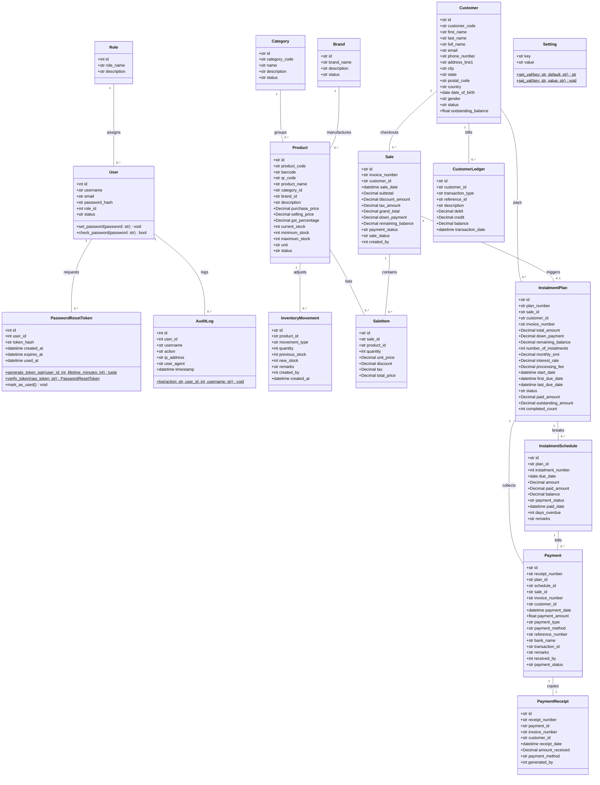

# PayEase - UML Class Diagram

This document contains the detailed UML Class Diagram for the **PayEase - Instalment Shop Management System**, representing the system's data model, class attributes, data types, class methods, and entity relationships.

The diagram is written in **Mermaid.js** syntax and renders dynamically.

---

## Class Diagram

---

## Entity Descriptions

### 1. User Authentication & Roles
* **`Role`**: Maps user permission privileges (Super Admin, Admin, Staff).
* **`User`**: System operators with email, hashed passwords, and active account flags.
* **`PasswordResetToken`**: Cryptographic SHA-256 tokens allowing secure, timed password resets.
* **`AuditLog`**: Centralized actions trail capturing client IP addresses and transaction summaries.

### 2. Product Catalog & Inventory
* **`Category`**: Grouping products (e.g. Electronics, Furniture).
* **`Brand`**: Brands manufacturing the products.
* **`Product`**: Stockable catalog items with purchase/selling price lists and low stock limits.
* **`InventoryMovement`**: Historical ledger tracking stock adjustments (Stock In / Stock Out).

### 3. POS Sales & Instalment Plans
* **`Customer`**: Client details tracking overall outstanding balances.
* **`Sale`**: Aggregate transaction details recording subtotal, tax amounts, and down payments.
* **`SaleItem`**: Individual checkout cart items listing prices, quantities, and GST.
* **`InstalmentPlan`**: Active instalment payment plans mapping down payments, monthly EMI values, and interest.
* **`InstalmentSchedule`**: Monthly schedule rows tracking specific due dates, paid values, and overdue counts.
* **`Payment`**: Collection transactions recording cash/UPI transfers mapping receipt references.
* **`PaymentReceipt`**: Legally compliant physical receipt references.
* **`CustomerLedger`**: Double-entry ledger ledger columns mapping debits (sales) and credits (collection payments) sequentially.
* **`Setting`**: Key-value pairs configuration settings.
