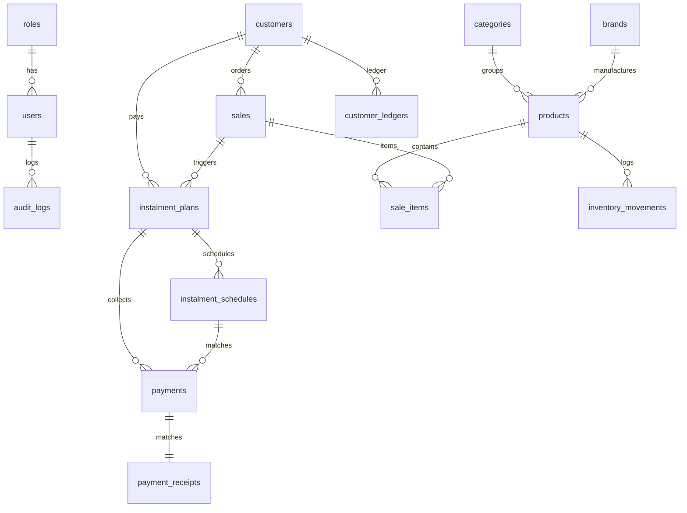

# Database Schema & ER Diagram

This document defines the schema architecture, keys, constraints, and entity-relationship mapping for the SQLite database.

---

## 📊 Entity Relationship (ER) Diagram

---

## 🗄️ Database Tables

### 1. `users`
* `id`: `INTEGER` (Primary Key)
* `username`: `VARCHAR(120)` (Unique, Not Null)
* `email`: `VARCHAR(120)` (Unique, Not Null)
* `password_hash`: `VARCHAR(128)` (Not Null)
* `role_id`: `INTEGER` (Foreign Key to `roles.id`)
* `status`: `VARCHAR(20)` (Default: `'active'`)

### 2. `customers`
* `id`: `VARCHAR(36)` (Primary Key, UUID)
* `customer_code`: `VARCHAR(20)` (Unique, Not Null)
* `full_name`: `VARCHAR(100)` (Not Null)
* `email`: `VARCHAR(120)` (Unique)
* `phone_number`: `VARCHAR(20)`
* `status`: `VARCHAR(20)` (Default: `'active'`)

### 3. `products`
* `id`: `VARCHAR(36)` (Primary Key, UUID)
* `product_code`: `VARCHAR(20)` (Unique, Not Null)
* `product_name`: `VARCHAR(100)` (Not Null)
* `purchase_price`: `NUMERIC(10, 2)` (Not Null)
* `selling_price`: `NUMERIC(10, 2)` (Not Null)
* `current_stock`: `INTEGER` (Default: `0`)
* `minimum_stock`: `INTEGER` (Default: `5`)

### 4. `sales`
* `id`: `VARCHAR(36)` (Primary Key, UUID)
* `invoice_number`: `VARCHAR(20)` (Unique, Not Null)
* `customer_id`: `VARCHAR(36)` (Foreign Key to `customers.id`)
* `grand_total`: `NUMERIC(10, 2)` (Not Null)
* `remaining_balance`: `NUMERIC(10, 2)`
* `payment_status`: `VARCHAR(20)` (e.g. `'paid'`, `'partial'`)

### 5. `instalment_plans`
* `id`: `VARCHAR(36)` (Primary Key, UUID)
* `plan_number`: `VARCHAR(20)` (Unique, Not Null)
* `sale_id`: `VARCHAR(36)` (Foreign Key to `sales.id`)
* `customer_id`: `VARCHAR(36)` (Foreign Key to `customers.id`)
* `remaining_balance`: `NUMERIC(10, 2)` (Not Null)
* `monthly_emi`: `NUMERIC(10, 2)` (Not Null)
* `status`: `VARCHAR(20)` (Default: `'active'`)

### 6. `instalment_schedules`
* `id`: `VARCHAR(36)` (Primary Key, UUID)
* `plan_id`: `VARCHAR(36)` (Foreign Key to `instalment_plans.id`)
* `instalment_number`: `INTEGER` (Not Null)
* `due_date`: `DATE` (Not Null)
* `amount`: `NUMERIC(10, 2)` (Not Null)
* `paid_amount`: `NUMERIC(10, 2)` (Default: `0.00`)
* `balance`: `NUMERIC(10, 2)` (Not Null)
* `payment_status`: `VARCHAR(20)` (Default: `'pending'`)

### 7. `payments`
* `id`: `VARCHAR(36)` (Primary Key, UUID)
* `receipt_number`: `VARCHAR(20)` (Unique, Not Null)
* `plan_id`: `VARCHAR(36)` (Foreign Key to `instalment_plans.id`)
* `schedule_id`: `VARCHAR(36)` (Foreign Key to `instalment_schedules.id`)
* `payment_amount`: `NUMERIC(10, 2)` (Not Null)
* `payment_method`: `VARCHAR(20)` (Cash, UPI, Card, etc.)

### 8. `customer_ledgers`
* `id`: `VARCHAR(36)` (Primary Key, UUID)
* `customer_id`: `VARCHAR(36)` (Foreign Key to `customers.id`)
* `transaction_type`: `VARCHAR(10)` (debit or credit)
* `debit`: `NUMERIC(10, 2)`
* `credit`: `NUMERIC(10, 2)`
* `balance`: `NUMERIC(10, 2)`
* `transaction_date`: `DATETIME`

### 9. `settings`
* `key`: `VARCHAR(50)` (Primary Key)
* `value`: `TEXT`
